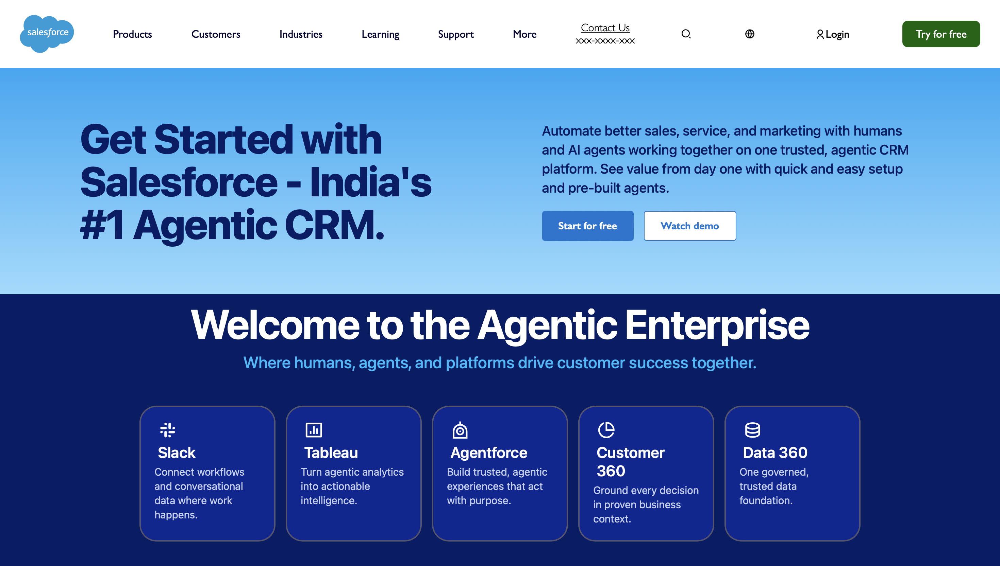

# Salesforce Agentic CRM Clone

A pixel-perfect frontend clone of the Salesforce landing page, featuring the modern "Agentic Enterprise" interface, dynamic linear gradients, and a responsive flexbox card grid layout.

---

## Dashboard Preview

<p align="center">
  
</p>
---

##  Features

* **Fixed Navigation Header:** Clean navigation bar utilizing custom dropdown indicators and modern login iconography via Remix Icons.
* **Hero Gradient Banner:** Features a custom `linear-gradient` transition that mirrors the signature Salesforce sky blue fading layout with high-contrast typography.
* **Agentic Grid Layout:** A beautifully aligned flexbox card row presenting the Salesforce sub-brands (Slack, Tableau, Agentforce) with customized left-aligned iconography and crisp text tracking.
* **Semantic Structure:** Well-organized HTML5 and CSS3 architecture resolving layout overlaps and ghost divs.

---

##  Tech Stack Used

* **HTML5:** Semantic markup structure.
* **CSS3:** Flexbox layout engine, custom UI spacing, and multi-stop linear gradients.
* **Remix Icons:** Premium open-source iconography web font for high-definition brand icons.

---

##  How to Run the Project Locally

1. **Clone the Repository:**
   ```bash
   git clone [https://github.com/arzaanxeng/Frontend.git](https://github.com/arzaanxeng/Frontend.git)
